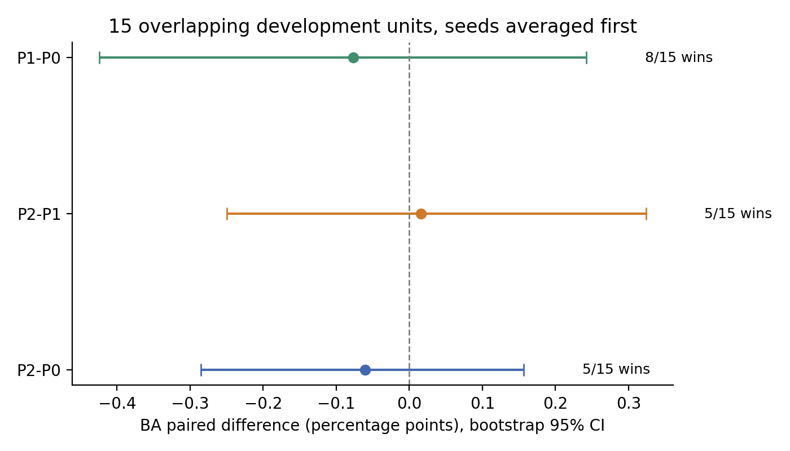
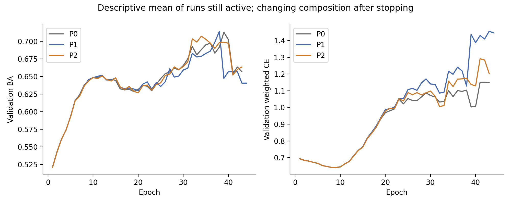

# Patch-based Temporal STR 正式开发报告（2026-10-08）

## 最终结论：REJECT

- Q1：P1对P0，未建立稳定增量。BAΔ=-0.000765，8/15胜，95%CI[-0.004240,+0.002423]，primary BH q=0.761536。
- Q2：P2对P1，未建立超过bag-of-patches的稳定增量。BAΔ=+0.000157，5/15胜，95%CI[-0.002495,+0.003238]，q=0.761536。
- Q3：P2对P0 BAΔ=-0.000608，5/15胜，CI[-0.002851,+0.001566]；正式决策按冻结的全部门槛为 **REJECT**，不能只挑正向指标。
- Q4：当前结果符合“固定local patch配置未建立稳定BA增量”，不是“已证明patch有效但order无效”。P1/P2均有小幅AUROC均值增加，但不能替代BA门槛；不能从失败推导所有patch表征对PD/DD无用，也不能宣称已证明原STR存在information loss。

## 1. 实际执行与边界

P0完整45checkpoint全validation复现、15个train-only normalization refit、已有Phase2当前source45次scratch复现均PASS，正式P0重用。P1/P2各完整15split×3seed=45scratch runs，共90，另有correctness two-step与one-batch one-epoch smoke；P3未在本阶段训练。没有使用outer-test信号/结果，没有WSSL/HarNet/Frequency/FFT，没有改loss、weights、sampler、augmentation、optimizer、LR、WD、scheduler、batch、patience、threshold、activity/wrist顺序或原STR路径。context/outer_N目录仅development split索引，test subjects列表为空。

所有候选正式训练前冻结源码和统计；preformal Git `b06f166a392e625323037c42c3cca2c3969c390a`，tag `patch-str-preformal-freeze-20261008`；study_lock SHA `123d260ad9c3dc1d2294432c7a9b12350ba308078d512f331ea3056bd22a25c0`。训练后audit/hash guard PASS，正式STR checkpoint/prediction/source未修改。P0旧source whole-tree hash不能直接说完全等于当前；最新Phase2匹配source加本轮数值复现建立可复现性，详见BASELINE_AUDIT.md。

参数：P0 75,524；P1 80,340（+4,816）；P2 80,661（+5,137，比P1多321）；本轮全部参数trainable，无外部encoder。200sample/stride100，976→9patch，2000→19patch；共享6→32→64encoder，无perpatch normalization；zero-init64→16→64 residual注入原wrist64。

## 2. 正确性与新增文件

- extraction数量/start/first/last/tail/no-overflow/determinism/autograd和padding隔离PASS。
- 两条件45个正式checkpoint零初始化logits/重载逐值一致；三seed原STR初始化、CPU/CUDA RNG一致，P1/P2共用encoder/head逐值一致。
- 第一次backward上游encoder/aggregator梯度0、projection非零；第二次上游有限非零、参数实际更新；P1/P2模型+optimizer保存重载一致。
- absent wrist/activity、padded sample/patch、空patch行隔离PASS；P1置换不变，P2有顺序响应。
- 原训练engine两个smoke PASS，保存best后重载validation inference；smoke分数未参与筛选。
- 独立目录scripts包括common/audit_p0、patch_extractor/encoder/models、test_extraction/models、run_condition/launch_matrix、analyze_results/test_analysis_contract、freeze_study、conditional_diagnostics、publish_stage；report rendering只展示冻结分析产物，不修改统计或规则。

## 3. 六指标：seed-first15split均值

| Condition | Accuracy | BA | AUROC | Macro-F1 | PD Recall | DD Recall |
| --- | --- | --- | --- | --- | --- | --- |
| P0 | 0.730718 | 0.697189 | 0.717631 | 0.686068 | 0.777864 | 0.616515 |
| P1 | 0.728773 | 0.696424 | 0.720416 | 0.684746 | 0.774540 | 0.618308 |
| P2 | 0.730912 | 0.696581 | 0.721293 | 0.686044 | 0.779374 | 0.613789 |

以下表格小数为比例；BA差乘100才是百分点。没有只报最好seed、split、epoch或ensemble。

## 4. Primary BA配对证据（BH family=3）

| comparison | mean_delta | improve_count | tie_count | worse_count | ci_low | ci_high | paired_dz | rank_biserial | wilcoxon_p | bh_q_primary_ba3 |
| --- | --- | --- | --- | --- | --- | --- | --- | --- | --- | --- |
| P2-P0 | -0.000608 | 5 | 2 | 8 | -0.002851 | 0.001566 | -0.134194 | -0.098901 | 0.753079 | 0.761536 |
| P2-P1 | 0.000157 | 5 | 0 | 10 | -0.002495 | 0.003238 | 0.026964 | -0.100000 | 0.733220 | 0.761536 |
| P1-P0 | -0.000765 | 8 | 0 | 7 | -0.004240 | 0.002423 | -0.112078 | -0.100000 | 0.761536 | 0.761536 |

95%CI为10,000个paired split重采样，bootstrap seed20261008；Wilcoxon双侧、dz和rank-biserial分别报告。bootstrap与Wilcoxon/BH是不同结果，不互替。15划分共享subjects与train pool，CI及p/q仅repeated-development描述，不能当独立外部确认。

## 5. 全部配对指标（18个探索性BH）

| comparison | metric | mean_delta | improve_count | tie_count | worse_count | ci_low | ci_high | paired_dz | rank_biserial | wilcoxon_p | bh_q_18 |
| --- | --- | --- | --- | --- | --- | --- | --- | --- | --- | --- | --- |
| P2-P0 | accuracy | 0.000193 | 6 | 5 | 4 | -0.005779 | 0.005505 | 0.016852 | 0.163636 | 0.644738 | 0.806332 |
| P2-P0 | ba | -0.000608 | 5 | 2 | 8 | -0.002851 | 0.001566 | -0.134194 | -0.098901 | 0.753079 | 0.806332 |
| P2-P0 | auroc | 0.003662 | 11 | 0 | 4 | 0.000435 | 0.007246 | 0.524405 | 0.533333 | 0.072998 | 0.778617 |
| P2-P0 | macro_f1 | -0.000024 | 7 | 2 | 6 | -0.002704 | 0.003245 | -0.003939 | -0.120879 | 0.700703 | 0.806332 |
| P2-P0 | pd_recall | 0.001510 | 8 | 3 | 4 | -0.014110 | 0.013814 | 0.053496 | 0.435897 | 0.181833 | 0.778617 |
| P2-P0 | dd_recall | -0.002726 | 3 | 3 | 9 | -0.015272 | 0.015006 | -0.086173 | -0.423077 | 0.194506 | 0.778617 |
| P2-P1 | accuracy | 0.002139 | 9 | 0 | 6 | -0.002114 | 0.006392 | 0.245890 | 0.333333 | 0.255413 | 0.778617 |
| P2-P1 | ba | 0.000157 | 5 | 0 | 10 | -0.002495 | 0.003238 | 0.026964 | -0.100000 | 0.733220 | 0.806332 |
| P2-P1 | auroc | 0.000876 | 7 | 0 | 8 | -0.000975 | 0.002843 | 0.226400 | 0.200000 | 0.524475 | 0.806332 |
| P2-P1 | macro_f1 | 0.001298 | 7 | 0 | 8 | -0.001771 | 0.004595 | 0.197710 | 0.133333 | 0.678772 | 0.806332 |
| P2-P1 | pd_recall | 0.004834 | 8 | 1 | 6 | -0.004245 | 0.013267 | 0.264317 | 0.333333 | 0.271711 | 0.778617 |
| P2-P1 | dd_recall | -0.004519 | 4 | 4 | 7 | -0.013982 | 0.005735 | -0.220643 | -0.378788 | 0.265930 | 0.778617 |
| P1-P0 | accuracy | -0.001946 | 6 | 0 | 9 | -0.010918 | 0.006123 | -0.112034 | -0.100000 | 0.733220 | 0.806332 |
| P1-P0 | ba | -0.000765 | 8 | 0 | 7 | -0.004240 | 0.002423 | -0.112078 | -0.100000 | 0.761536 | 0.806332 |
| P1-P0 | auroc | 0.002785 | 8 | 0 | 7 | -0.001252 | 0.007276 | 0.318868 | 0.316667 | 0.302795 | 0.778617 |
| P1-P0 | macro_f1 | -0.001322 | 7 | 0 | 8 | -0.006246 | 0.003702 | -0.130088 | -0.183333 | 0.561401 | 0.806332 |
| P1-P0 | pd_recall | -0.003324 | 6 | 1 | 8 | -0.024921 | 0.014160 | -0.084019 | -0.104762 | 0.729827 | 0.806332 |
| P1-P0 | dd_recall | 0.001794 | 6 | 4 | 5 | -0.016341 | 0.023849 | 0.044130 | 0.045455 | 0.893852 | 0.893852 |

## 6. 种子与split波动

| condition | seed | accuracy | ba | auroc | macro_f1 | pd_recall | dd_recall |
| --- | --- | --- | --- | --- | --- | --- | --- |
| P0 | 42 | 0.745709 | 0.708392 | 0.727649 | 0.698472 | 0.798038 | 0.618747 |
| P0 | 43 | 0.715530 | 0.698126 | 0.720883 | 0.679735 | 0.740096 | 0.656156 |
| P0 | 44 | 0.730915 | 0.685050 | 0.704360 | 0.679997 | 0.795458 | 0.574641 |
| P1 | 42 | 0.737314 | 0.711328 | 0.735031 | 0.696229 | 0.774503 | 0.648152 |
| P1 | 43 | 0.719340 | 0.694453 | 0.718945 | 0.679262 | 0.754548 | 0.634359 |
| P1 | 44 | 0.729664 | 0.683492 | 0.707273 | 0.678748 | 0.794570 | 0.572414 |
| P2 | 42 | 0.746240 | 0.713097 | 0.737108 | 0.702006 | 0.793459 | 0.632735 |
| P2 | 43 | 0.714223 | 0.694610 | 0.721105 | 0.677218 | 0.741886 | 0.647334 |
| P2 | 44 | 0.732272 | 0.682037 | 0.705665 | 0.678908 | 0.802777 | 0.561298 |

| condition | metric | seed_mean_sd | mean_within_split_seed_sd | split_sd |
| --- | --- | --- | --- | --- |
| P0 | accuracy | 0.015091 | 0.034259 | 0.030642 |
| P0 | ba | 0.011699 | 0.030011 | 0.031579 |
| P0 | auroc | 0.011980 | 0.032350 | 0.039340 |
| P0 | macro_f1 | 0.010743 | 0.028518 | 0.031561 |
| P0 | pd_recall | 0.032733 | 0.077042 | 0.043973 |
| P0 | dd_recall | 0.040803 | 0.102377 | 0.062189 |
| P1 | accuracy | 0.009021 | 0.031493 | 0.029389 |
| P1 | ba | 0.014022 | 0.031382 | 0.031809 |
| P1 | auroc | 0.013937 | 0.029649 | 0.039790 |
| P1 | macro_f1 | 0.009947 | 0.029584 | 0.030566 |
| P1 | pd_recall | 0.020011 | 0.066644 | 0.046987 |
| P1 | dd_recall | 0.040340 | 0.089480 | 0.072085 |
| P2 | accuracy | 0.016052 | 0.034099 | 0.027509 |
| P2 | ba | 0.015624 | 0.030743 | 0.030864 |
| P2 | auroc | 0.015723 | 0.030520 | 0.040260 |
| P2 | macro_f1 | 0.013849 | 0.028995 | 0.029746 |
| P2 | pd_recall | 0.032798 | 0.075289 | 0.038128 |
| P2 | dd_recall | 0.046041 | 0.097628 | 0.062303 |

跨seed预测一致性（每split再平均）：

| condition | unanimity | mean_pair_agreement | mean_pair_score_spearman |
| --- | --- | --- | --- |
| P0 | 0.644221 | 0.762814 | 0.600027 |
| P1 | 0.647956 | 0.765304 | 0.600725 |
| P2 | 0.647993 | 0.765329 | 0.604629 |

同seed不同模型的一致性（seed-first再15split平均）：

| comparison | prediction_agreement | score_spearman |
| --- | --- | --- |
| P1-P0 | 0.944211 | 0.949532 |
| P2-P0 | 0.961690 | 0.974788 |
| P2-P1 | 0.969230 | 0.970050 |

## 7. 训练轨迹、停止与耗时

| condition | best_epoch_mean | stop_epoch_mean | best_online_train_ce | best_val_ce | last_online_train_ce | last_val_ce | best_val_ba | last_val_ba | best_val_auroc | last_val_auroc |
| --- | --- | --- | --- | --- | --- | --- | --- | --- | --- | --- |
| P0 | 13.488889 | 25.488889 | 0.338780 | 0.714679 | 0.041499 | 1.086545 | 0.697189 | 0.627538 | 0.717631 | 0.701200 |
| P1 | 13.555556 | 25.555556 | 0.331051 | 0.718425 | 0.042518 | 1.119798 | 0.696424 | 0.629635 | 0.720416 | 0.701733 |
| P2 | 13.800000 | 25.800000 | 0.332158 | 0.716444 | 0.040215 | 1.104868 | 0.696581 | 0.631285 | 0.721293 | 0.702663 |

epoch曲线只作描述；后期仅未停止runs仍存在，组成变化不能解释为配对性能改进。online train loss/BA含训练Dropout，不是eval-mode train performance；不据此宣称真实泛化gap。只有best/last权重，不虚构中间checkpoint或EMA。epoch_trajectories.csv保留所有训练epoch的train CE/BA、validation CE/BA/AUROC/F1/两Recall；best/stop逐run保留。无结果后增加max epochs/patience。

| condition | train_epoch_seconds_total | validation_epoch_seconds_total | mean_train_epoch_seconds | mean_validation_epoch_seconds | current_training_prediction_wall_seconds |
| --- | --- | --- | --- | --- | --- |
| P0 | 8.790676 | 2.927790 | 0.345427 | 0.115022 | NA |
| P1 | 13.033764 | 4.416724 | 0.510593 | 0.172945 | 19.136968 |
| P2 | 13.864780 | 4.566444 | 0.538232 | 0.177011 | 20.167831 |

P0 timing来自原归档train/validation duration，不是本轮重新运行；其current wall time为NA。P1/P2 wall time是真实本轮原引擎训练+预测耗时；不把历史硬件/runtime差异当严格速度配对证据。

## 8. 纠正/伤害变化（每validation unit平均，不是独立subjects数）

| comparison | label | subject_count | reference_errors | candidate_errors | corrected | harmed | net_corrected |
| --- | --- | --- | --- | --- | --- | --- | --- |
| P1-P0 | DD | 30.400000 | 11.666667 | 11.622222 | 0.911111 | 0.866667 | 0.044444 |
| P1-P0 | PD | 73.600000 | 16.355556 | 16.600000 | 1.888889 | 2.133333 | -0.244444 |
| P2-P0 | DD | 30.400000 | 11.666667 | 11.755556 | 0.555556 | 0.644444 | -0.088889 |
| P2-P0 | PD | 73.600000 | 16.355556 | 16.244444 | 1.444444 | 1.333333 | 0.111111 |
| P2-P1 | DD | 30.400000 | 11.622222 | 11.755556 | 0.422222 | 0.555556 | -0.133333 |
| P2-P1 | PD | 73.600000 | 16.600000 | 16.244444 | 1.288889 | 0.933333 | 0.355556 |

同一subject可能在多split出现；这些是seed-first15unit平均的事件计数。DD subtype门槛为P2正式RETAIN，未满足时不访问或分析clinical subtype表。

## 9. 保留门槛逐项审计与条件诊断

| comparison | ba_mean_positive | ba_improvement_at_least_10 | ba_ci_low_positive | ba_primary_bh_pass | auroc_drop_at_most_005 | f1_non_decrease | pd_recall_drop_at_most_01 | dd_recall_drop_at_most_01 | ba_within_seed_sd_at_most_125 | auroc_within_seed_sd_at_most_125 |
| --- | --- | --- | --- | --- | --- | --- | --- | --- | --- | --- |
| P2-P0 | False | False | False | False | True | False | True | True | True | True |
| P2-P1 | True | False | False | False | True | True | True | True | True | True |

规则直接沿用已有三条件STR residual protocol，训练前固定：P2对P0/P1均须BAmean>0、≥10wins、CI下界>0、primaryBA BH<.05；AUCΔ≥−.005、F1不下降、两Recall各Δ≥−.01，BA/AUC withinseedSD≤1.25×reference（floor.001）。不按单个显著结果或attention外观保留。

利用/order-shuffle状态：`SKIPPED`。P1利用诊断允许=False；P2/order-shuffle允许=False；DD-subtype/P3门槛=False。未满足门槛的解释分析直接skip，不用于“救援”或活动选择。

## 10. 机制判断与后续

本轮正向但不足的证据是P2-P0 AUROCΔ+0.003662（11/15胜，bootstrap95%CI[+0.000435,+0.007246]）；Wilcoxon p=0.072998、18探索比较BH q=0.778617，必须与bootstrap结果分开保留。BA primary三个q均0.761536，三个CI均跨0。P2-P1虽BA均值微正，但只有5/15胜、10/15负，未形成可重复的ordered增量。Macro-F1的P2-P0负差约−0.000024非常小，不能宣称临床上明显恶化；其违反严格非下降门槛，而BA不提升已足以拒绝。

P0/P1/P2 best epoch平均13.49/13.56/13.80，stop epoch平均25.49/25.56/25.80，均median best12/stop24。没有明显系统性更早停止或更晚最佳点；best后validation CE上升、BA下降在三条件均发生，未显示patch方案解决晚期退化。online train CE不能用于计算eval-mode泛化gap，也不据此更改epoch/patience。

mean within-split seed BA SD为0.030011/0.031382/0.030743，AUROC SD为0.032350/0.029649/0.030520；正式种子保护均通过。因此失败重点是未建立稳定配对增量，而不是宣称seed variance保护失败。仅3个seed均值的SD另有增加，完整报告保留，不能对三个seed作独立显著性推断。

绘图依赖曾缺失，已安装在独立/home/zyt/envs/patch_report_deps_20261008目录；只用于本报告渲染，不进入训练或冻结统计环境。未改冻结研究文件，非实验协议偏离。

P2-P1同时增加depthwise序列卷积、attention pooling和321参数，不能把任何差异孤立归因于order或capacity。窗口的标称100Hz/2s是固定设计，不代表已验证最佳生理时间尺度。当前结果只覆盖这一实现、这一输入处理与固定训练budget。

正负结果、CI跨0、种子/Recall trade-off均完整保留；当前 **REJECT** 不改变既有FrozenWSSL retained best。P3执行条件=False；不满足则STOP temporal adjacency pretext、WSSL+Patch、patch/stride/hidden/pooling rescue。Frequency组合始终禁止。若门槛满足，仅允许按预注册规则进入条件阶段，不能扩大搜索。

## 阶段验收摘要

1. 完成：审计、正确性、90次训练、135行run性能、15unit统计、轨迹/错误/条件门槛。
2. 文件：本独立artifact代码、PROTOCOL/审计/test/smoke报告、analysis聚合表、figures、本报告；README和handoff追加结果。
3. 正确性及正式run审计PASS。
4. outer未访问。
5. 原recipe未改。
6. 无协议偏离；未执行不满足门槛的后续。
7. 完整六指标与三主比较/18探索比较如上。
8. 下一阶段资格严格见冻结decision.json，不事后重定义。
