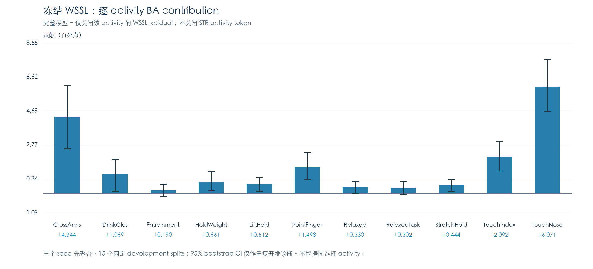
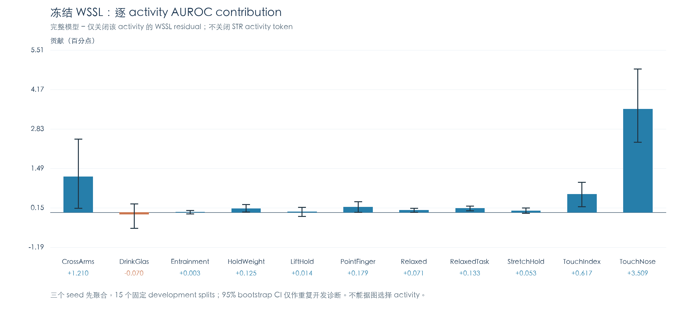

# Phase A：Frozen WSSL-STR 增量贡献诊断报告

日期：2026-10-07。**已完成；CASE A / PROCEED。** 当前最佳仍是原 Frozen WSSL-STR。

**本轮只有 inference-only 诊断，训练次数/optimizer steps 均为0；未启动 Phase B 或 Phase C。** PROCEED 表示满足提出单一11-scalar对照的证据资格，不表示已经批准或运行下一阶段。

## 1. 实际执行与复现验收

原45个正式 WSSL checkpoint（15 development splits × seeds42/43/44）全部完整 validation inference。验证两个归档概率列/decision/六指标，ID/label、train/validation分离、SSL ID查找/activities/两腕/finite/window counts/cache SHA匹配；15次原inner-train normalization refit与45checkpoint mean/std逐位相同。全部原权重、cache、正式源文件和结果SHA未变。

**归档CSV没有logits。** 全部validation batches中原历史forward、新独立显式SSL接口、复用原wrist与projected residual的诊断forward logits逐位一致；归档概率最大差异1.11×10⁻¹⁶，decision和指标一致。不伪称对照了不存在的归档logit文件。

实际residual为 `Linear(LayerNorm(SSL))`。只在该投影输出后清零，包括bias；不是把SSL输入清零。首个真实8subject batch的37条件与projection输出hook的直接完整forward逐位一致；零SSL输入与真实all-residual-off最大logit差异0.00214644。checkpoint重载/ID重排、模型状态/cache不变PASS。没有scratch训练、backward或HarNet重提取。

全部45实例执行：11 activity-off、left-off、right-off、22 activity×wrist-off，共35个用户指定mask；另外一个预先固定all-WSSL-off诊断锚点。加full共37条件、1,665个condition-run指标行、173,160行私有subject-condition记录。原STR wrist/activity token、length、mask、bilateral/activity/structured路径完整保留。缓存存储受NPZ格式限制可能整体解压，但在构建tensor前仅选当前validation ID，排除行不进入forward或统计；inner-train信号仅用于原normalization refit。无outer loader/outcome/performance。

classifier侧参数143,172，外部HarNet frozen参数10,457,408，总计10,600,580；新增模型参数0。独立诊断接口不改变正式模型结构。完整复现、屏蔽接口、统计代码/CASE门槛已于masked结果之前SHA冻结及Git发布，见 [复现报告](REPRODUCTION_REPORT.md)、[运行前协议](PROTOCOL.md)、`analysis/pre_mask_publication.json`。

## 2. 正式 WSSL 与纯 STR 联系（不是重新训练）

所有checkpoint的validation ID/label/split/seed严格一致。以下正式performance先在split内平均三个seed的指标，再以15split等权汇总：

|模型|Accuracy|BA|AUROC|Macro-F1|PD Recall|DD Recall|
|---|---|---|---|---|---|---|
|原STR-01|0.730718|0.697189|0.717631|0.686068|0.777864|0.616515|
|Frozen WSSL-STR|0.745604|0.719644|0.759553|0.706589|0.782344|0.656945|

|WSSL−STR指标|均值Δ|中位数Δ|正/零/负split|split SD|bootstrap95%CI|
|---|---|---|---|---|---|
|Accuracy|+0.014885|+0.025890|12/0/3|0.041104|[-0.005447, +0.033791]|
|BA|+0.022455|+0.014749|11/0/4|0.027561|[+0.009758, +0.036112]|
|AUROC|+0.041922|+0.040831|15/0/0|0.024766|[+0.030085, +0.053994]|
|Macro-F1|+0.020522|+0.018836|12/0/3|0.034532|[+0.004248, +0.036953]|
|PD Recall|+0.004480|+0.004505|8/1/6|0.074343|[-0.033062, +0.038847]|
|DD Recall|+0.040430|+0.043011|11/1/3|0.069129|[+0.006953, +0.073860]|

WSSL的正式改善以DD更明显：DD Recall +.040430（约4.04pp，11正/1零/3负），PD +.004480但区间跨零；AUROC +.041922，15/15正。不是单独Accuracy提高。该比较仍复用了已用于开发的subjects/splits，CI仅描述重复development，不增加外部支持。

两类改善差距是描述性数值，不以一类CI跨零、另一类不跨零证明类间显著差异；本轮未做新的类间显著性推断。

## 3. Table 1：activity contribution

**Contribution=Full−Masked；正数表示删除该activity的SSL路径后性能下降。** 所有数值为概率/metric单位，不是百分数；pp=数值×100。positive_split_count指BA的15seed-first split。

|Activity|ΔAccuracy|ΔBA|ΔAUROC|ΔMacro-F1|ΔPD Recall|ΔDD Recall|BA正/零/负split|
|---|---|---|---|---|---|---|---|
|CrossArms|+0.055152|+0.043440|+0.012101|+0.061268|+0.071710|+0.015171|12/0/3|
|DrinkGlas|+0.007677|+0.010689|-0.000703|+0.011061|+0.003550|+0.017827|12/0/3|
|Entrainment|+0.000853|+0.001901|+0.000034|+0.001552|-0.000592|+0.004395|8/2/5|
|HoldWeight|+0.006392|+0.006611|+0.001248|+0.006967|+0.006031|+0.007191|9/1/5|
|LiftHold|+0.010886|+0.005123|+0.000137|+0.008756|+0.019018|-0.008771|12/0/3|
|PointFinger|+0.006888|+0.014985|+0.001794|+0.012584|-0.004472|+0.034441|12/0/3|
|Relaxed|+0.003436|+0.003303|+0.000710|+0.003484|+0.003641|+0.002965|7/3/5|
|RelaxedTask|+0.001508|+0.003021|+0.001330|+0.002336|-0.000601|+0.006643|7/4/4|
|StretchHold|+0.005973|+0.004439|+0.000528|+0.005485|+0.008137|+0.000741|11/0/4|
|TouchIndex|+0.006668|+0.020917|+0.006167|+0.015129|-0.013320|+0.055154|13/0/2|
|TouchNose|+0.022929|+0.060713|+0.035089|+0.049834|-0.030026|+0.151451|15/0/0|

### BA描述性稳定性（每个activity保留完整15split，不将activity当独立样本）

|Activity|meanΔBA|medianΔBA|split SD|bootstrap95%CI|
|---|---|---|---|---|
|CrossArms|+0.043440|+0.042647|0.036593|[+0.025258, +0.061283]|
|DrinkGlas|+0.010689|+0.013394|0.018190|[+0.001249, +0.019196]|
|Entrainment|+0.001901|+0.002252|0.007031|[-0.001590, +0.005300]|
|HoldWeight|+0.006611|+0.004505|0.010820|[+0.001729, +0.012441]|
|LiftHold|+0.005123|+0.004655|0.008119|[+0.001171, +0.008942]|
|PointFinger|+0.014985|+0.015677|0.015301|[+0.007942, +0.023121]|
|Relaxed|+0.003303|+0.000000|0.006939|[+0.000034, +0.006832]|
|RelaxedTask|+0.003021|+0.000000|0.007424|[-0.000542, +0.006651]|
|StretchHold|+0.004439|+0.002252|0.006846|[+0.001127, +0.007851]|
|TouchIndex|+0.020917|+0.018745|0.017007|[+0.012745, +0.029523]|
|TouchNose|+0.060713|+0.057786|0.029989|[+0.046559, +0.076195]|

### AUROC描述性稳定性

|Activity|meanΔAUROC|正/零/负split|bootstrap95%CI|
|---|---|---|---|
|CrossArms|+0.012101|11/0/4|[+0.001380, +0.024863]|
|DrinkGlas|-0.000703|9/0/6|[-0.005404, +0.002803]|
|Entrainment|+0.000034|8/2/5|[-0.000577, +0.000610]|
|HoldWeight|+0.001248|11/0/4|[+0.000074, +0.002610]|
|LiftHold|+0.000137|7/0/8|[-0.001392, +0.001617]|
|PointFinger|+0.001794|10/0/5|[-0.000079, +0.003613]|
|Relaxed|+0.000710|10/1/4|[-0.000005, +0.001367]|
|RelaxedTask|+0.001330|11/2/2|[+0.000519, +0.002121]|
|StretchHold|+0.000528|8/0/7|[-0.000376, +0.001432]|
|TouchIndex|+0.006167|12/0/3|[+0.001866, +0.010170]|
|TouchNose|+0.035089|15/0/0|[+0.023816, +0.048604]|

TouchNose BA贡献+.060713/AUROC+.035089，均15/15正；CrossArms BA+.043440（12/15）/AUROC+.012101（11/15）；TouchIndex BA+.020917（13/15）。Entrainment BA+.001901且CI跨零；Relaxed/RelaxedTask BA仅约+.0033/+.0030，中位数为0，不能按临床想象称其最强。11activity平均BA都为正，但效应幅度和类方向明显不均匀。DrinkGlas平均AUROC微负−.000703、CI跨零；不是稳定harm。

类贡献不同：CrossArms主要支持PD（PD Recall+.071710）；TouchNose主要支持DD（DD+.151451）但PD−.030026；TouchIndex也DD正/PD负。不能把这些当成活动本身的因果疾病特异性，也不能据此删活动或validation-informed初始化未来g。

### Activity profile的预先固定分流

平均BA profile的max−min=0.058811，描述性bootstrap95%CI[0.047043,0.076101]。三个seed的profile Spearman为.7091/.7818/.9000（中位数.7818）；split与其余14split均值profile的leave-one-split-out Spearman中位数.7000，15/15为正；7个activity在≥10/15split中正BA contribution。

|运行前诊断闸门|结果|
|---|---|
|mean_BA_spread_at_least_005|通过|
|spread_bootstrap_lower_above_0025|通过|
|seed_profile_all_positive_median_at_least_05|通过|
|LOSO_median_at_least_03_and_10_positive|通过|
|at_least_two_activities_positive_10splits|通过|

**CASE A。** 预定threshold只是本轮的实用诊断分流值，不是临床界值或已知最优设计。max/min是同一整体profile的描述统计，bootstrap内重算spread；没有用11个显著性检验选择最佳activity。其CI不是经过选择修正的某两个活动的因果差异。

### 图：完整−屏蔽的BA与AUROC（诊断，不作activity selection）

## 4. Table 2：left/right contribution

|屏蔽条件|ΔAccuracy|ΔBA|ΔAUROC|ΔMacro-F1|ΔPD Recall|ΔDD Recall|BA正/零/负split|BA bootstrap95%CI|
|---|---|---|---|---|---|---|---|---|
|left|+0.031084|+0.065585|+0.025357|+0.058754|-0.016751|+0.147922|15/0/0|[+0.053381, +0.077907]|
|right|+0.028054|+0.062313|+0.025063|+0.057316|-0.020231|+0.144858|15/0/0|[+0.047084, +0.078133]|

### 直接比较左−右贡献（同一15split配对）

|指标|左−右均值|正/零/负split|bootstrap95%CI|
|---|---|---|---|
|Accuracy|+0.003030|8/0/7|[-0.021551, +0.026547]|
|BA|+0.003272|9/0/6|[-0.015570, +0.019864]|
|AUROC|+0.000294|7/0/8|[-0.013418, +0.013343]|
|Macro-F1|+0.001437|8/0/7|[-0.021906, +0.023569]|
|PD Recall|+0.003480|9/0/6|[-0.050716, +0.051269]|
|DD Recall|+0.003063|8/0/7|[-0.053879, +0.067868]|

两腕都重要：关闭单腕BA下降约6.56/6.23pp，均15/15正；但左−右BA仅+.003272、CI跨零，AUROC差+.000294、CI跨零。三个seed BA左−右方向为负/正/负，AUROC同样负/正/正。**没有稳定的整体left/right asymmetry证据**；不做wrist selection，也没有患侧/利手临床信息来解释侧性。

## 5. Table 3：activity×wrist contribution（22条件全部执行）

|Activity|Wrist|ΔAccuracy|ΔBA|ΔAUROC|ΔMacro-F1|ΔPD Recall|ΔDD Recall|BA正/零/负split|BA bootstrap95%CI|
|---|---|---|---|---|---|---|---|---|---|
|CrossArms|left|+0.017963|+0.025797|+0.001347|+0.026132|+0.007150|+0.044445|14/0/1|[+0.016237, +0.036294]|
|CrossArms|right|+0.022537|+0.024211|+0.003143|+0.028162|+0.019939|+0.028483|13/0/2|[+0.015913, +0.032422]|
|DrinkGlas|left|+0.006419|+0.007801|-0.000801|+0.008007|+0.004513|+0.011089|11/2/2|[+0.000452, +0.014245]|
|DrinkGlas|right|+0.008550|+0.012097|+0.001067|+0.012442|+0.003595|+0.020599|12/0/3|[+0.004538, +0.020331]|
|Entrainment|left|-0.000643|+0.001081|+0.000272|+0.000155|-0.003024|+0.005185|7/4/4|[-0.001694, +0.004006]|
|Entrainment|right|-0.001062|+0.000112|-0.000010|-0.000497|-0.002715|+0.002939|5/5/5|[-0.001682, +0.001970]|
|HoldWeight|left|+0.006619|+0.005928|+0.000551|+0.006862|+0.007557|+0.004299|11/1/3|[+0.002845, +0.009375]|
|HoldWeight|right|+0.006394|+0.004273|+0.000746|+0.005924|+0.009359|-0.000812|10/2/3|[+0.000948, +0.008248]|
|LiftHold|left|+0.006834|+0.003528|+0.000067|+0.005655|+0.011477|-0.004422|8/4/3|[+0.001053, +0.006201]|
|LiftHold|right|+0.005550|+0.002202|+0.000064|+0.004191|+0.010260|-0.005856|9/2/4|[-0.000691, +0.005156]|
|PointFinger|left|+0.001292|+0.006515|-0.000935|+0.004323|-0.006018|+0.019048|9/2/4|[+0.001511, +0.012356]|
|PointFinger|right|+0.004964|+0.009785|+0.002850|+0.008049|-0.001777|+0.021346|12/0/3|[+0.004401, +0.015567]|
|Relaxed|left|+0.002131|+0.003448|+0.000104|+0.003038|+0.000300|+0.006595|8/3/4|[+0.000497, +0.006881]|
|Relaxed|right|+0.000631|+0.001960|-0.000004|+0.001291|-0.001218|+0.005137|8/2/5|[-0.000010, +0.004072]|
|RelaxedTask|left|-0.000863|+0.002000|-0.000378|+0.000727|-0.004842|+0.008843|6/3/6|[-0.001424, +0.006000]|
|RelaxedTask|right|+0.001502|+0.004307|+0.000694|+0.003061|-0.002427|+0.011041|7/4/4|[+0.000770, +0.007881]|
|StretchHold|left|+0.005558|+0.003501|+0.000377|+0.004938|+0.008462|-0.001459|9/1/5|[+0.000312, +0.006962]|
|StretchHold|right|+0.002568|+0.000959|-0.000378|+0.001879|+0.004834|-0.002915|5/5/5|[-0.001218, +0.003825]|
|TouchIndex|left|+0.003210|+0.016739|+0.002653|+0.010817|-0.015731|+0.049209|13/0/2|[+0.009678, +0.024399]|
|TouchIndex|right|+0.003460|+0.015078|+0.002114|+0.009897|-0.012724|+0.042879|12/0/3|[+0.006382, +0.024371]|
|TouchNose|left|+0.024367|+0.033621|+0.015867|+0.030570|+0.011510|+0.055733|15/0/0|[+0.024565, +0.042831]|
|TouchNose|right|+0.015248|+0.035152|+0.010474|+0.027416|-0.012584|+0.082887|15/0/0|[+0.025012, +0.045722]|

TouchNose左右均BA正15/15（+.033621/+.035152），CrossArms左右也均有贡献（+.025797/+.024211）。全表保留近零及负AUROC点估计，不包装22条件的显著性，不挑活动/腕或修改网络。删除双腕的效应一般不等于删除左右单腕效应之和，因bilateral/attention/structured路径非线性且共同适配。

## 6. Table 4：subject-group contribution与真实WSSL−STR改善

主定义固定为DSG/RGD/PRR/PAG：每次validation先均值3seed概率，再对每人4次appearance求错误率；≥.75 stable-error、≤.25 stable-correct，其余unstable。用独立训练STR定义primary groups，74/284/32逐位复现人数。分组用validation correctness，具有选择效应和regression-to-mean风险；不是前瞻性ambiguity或临床phenotype。

本表的错误率/恢复/新增错误基于**四次seed-mean概率决策**，与正式表的“先平均三个seed指标”不同；只是描述，不是新正式性能。人数为unique subjects；appearance counts重复同一subject，不用于扩大样本量。

|STR主组|类别|unique n|appearances|STR error rate|WSSL error rate|恢复|新增错|净恢复|true-label probability gain|
|---|---|---|---|---|---|---|---|---|---|
|stable-correct|PD|222|888|0.0507|0.1081|31|82|-51|+0.013786|
|stable-correct|DD|62|248|0.0685|0.1694|13|38|-25|+0.003485|
|stable-error|PD|31|124|0.8871|0.5968|42|6|36|+0.116740|
|stable-error|DD|43|172|0.9070|0.6512|52|8|44|+0.084304|
|unstable|PD|23|92|0.5000|0.4348|25|19|6|+0.035994|
|unstable|DD|9|36|0.5000|0.4167|8|5|3|-0.006985|

STR stable-error组PD/DD的净恢复分别+36/+44 appearances；unstable为+6/+3；STR stable-correct反而−51/−25。这说明改善和损害同时存在；净恢复主要集中在原STR持续难例组，**不是主要修复unstable subjects**。但不能因分组选择效应将其解释为已证明的临床phenotype-overlap解决。WSSL同口径primary stable-error仍有68人（PD35/DD33），persistent errors没有消失。

本表汇总的seed-mean决策PD净恢复为−9、DD为+22 appearances；PD与正式单seed指标均值的微小正Δ不同。这是不同aggregation口径，不能把该分组表当作正式PD Recall的分解或替换原指标。

### 主组内当前WSSL对all-residual的依赖（完整−all-off锚点）

|STR主组|类别|n|Full error|All-off error|residual净恢复appearances|signed probability contribution|mean absolute shift|
|---|---|---|---|---|---|---|---|
|stable-correct|PD|222|0.1081|0.0777|-27|+0.088153|0.169796|
|stable-correct|DD|62|0.1694|0.3831|53|+0.150405|0.216333|
|stable-error|PD|31|0.5968|0.5403|-7|-0.038849|0.200449|
|stable-error|DD|43|0.6512|0.9244|47|+0.049946|0.201987|
|unstable|PD|23|0.4348|0.3043|-12|-0.006996|0.215149|
|unstable|DD|9|0.4167|0.7222|11|+0.066838|0.224667|

所有11activity与两腕/22交互的group表保存于 `analysis/subject_group_contribution.csv`，不只汇报上述强贡献路径。TouchNose的DD净恢复出现在三组（+31/+20/+3 appearances），同时PD三组有负净贡献；CrossArms主要PD stable-correct净贡献+41，但原STR stable-error DD为−4。这显示类/subject异质性，不得用名单重加权。

### 定义差异和sensitivity（不混人数）

|分组模型|定义|stable-correct n|stable-error n|unstable n|
|---|---|---|---|---|
|str|primary|284|74|32|
|str|strict4|222|44|124|
|str|all12|109|11|270|
|wssl|primary|279|68|43|
|wssl|strict4|228|38|124|
|wssl|all12|145|12|233|

primary如上；strict4为四次seed-mean全部对/全部错（EMA报告口径）；本轮all12字段是12个individual seed/context全部对/全部错的严格sensitivity（EMA式），**不是DSG历史12-appearance错误率阈值表**。运行前协议中“历史12”字样范围过宽，在此明确实际脚本的严格定义；不把不同阈值的人数并入primary或声称复现历史DSG sensitivity人数。所有辅助分组都未参与CASE/gate或模型选择。

## 7. 概率变化、边界subjects与纯STR联系

|类别|n|mean raw Δp_DD(WSSL−STR)|true-label meanΔp|median absolute subject shift|top10% absolute-shift share|individual prediction changed fraction|
|---|---|---|---|---|---|---|
|all|390|-0.009562|+0.028938|0.207432|17.457%|24.487%|
|PD|276|-0.027201|+0.027201|0.205493|17.618%|23.339%|
|DD|114|+0.033143|+0.033143|0.213395|18.350%|27.266%|

每人的probability summary先均值其12个既有development appearances，人数不用于CI。top10%仅是幅度集中度描述，不是hard-subject removal、样本选择或性能改写。

### 强路径屏蔽的幅度集中度与边界关系

|条件|top10% shift share|prediction flip fraction|flipped full距离.5中位数|unchanged full距离.5中位数|
|---|---|---|---|---|
|activity_off__CrossArms|19.570%|14.145%|0.115913|0.323883|
|activity_off__TouchNose|22.006%|14.252%|0.115473|0.318589|
|left_off|19.418%|16.197%|0.121006|0.325947|
|right_off|20.212%|15.577%|0.108332|0.327273|
|all_ssl_off|18.998%|25.876%|0.181948|0.334311|

TouchNose/CrossArms删除的top10%幅度份额约22%/20%，明显不是只由极少数subjects承担全部概率扰动；翻转确实更多发生在较靠近.5的subjects。raw Δp在subjects之间具有较大离散，并非同一个常数平移。影响覆盖较广，但净分类收益更集中，二者不能混为一谈。

### Activity removal effect与WSSL−STR score gain相关（仅描述）

|Activity|raw probability effect vs gain Spearman均值|true-label-oriented Spearman均值|
|---|---|---|
|CrossArms|0.4050|0.2974|
|DrinkGlas|0.1584|0.1384|
|Entrainment|0.2141|0.2059|
|HoldWeight|0.0850|0.0719|
|LiftHold|0.0904|0.0546|
|PointFinger|0.2556|0.1857|
|Relaxed|0.1791|0.1200|
|RelaxedTask|0.2313|0.1680|
|StretchHold|0.0377|0.0249|
|TouchIndex|0.3175|0.2702|
|TouchNose|0.3999|0.3594|

相关先每个split内平均三seed，再均值15split。不能将该相关当成activity因果份额；独立STR与WSSL的训练权重不同，删除residual还会触发trained model的非线性响应。

## 8. all-off锚点与解释边界

全WSSL关闭后，BA从.719644降至.604457，AUROC从.759553降至.670865，DD Recall降约.238375；原独立训练STR BA却为.697189。因此**当前WSSL分支删除依赖远大于独立STR→WSSL的净收益**，与共同适配或大幅mask造成的分布偏移等解释相容，但本诊断不能分离这些原因；不能把删除损失当作纯预训练知识的可加增益。mask=0是大的离训练状态干预，不能据此预言从g=1附近训练scalar一定有效。

1. 这是固定已训练模型的诊断依赖，未进行随机临床干预、重新训练matched ablation或独立队列验证。activity/wrist/bilateral/attention之间存在交互，贡献不可相加。

2. 15splits共享subjects/training pools，三个seed不是独立样本；1,665 condition-runs、173,160subject-condition记录、11activities、22交互和bootstrap次数均不构成独立样本量。

3. bootstrapCI只描述重复development。不做11/22条件显著性筛选或声称FDR确认；所有负结果保留。多阶段重复development已有selection optimism，LOSO只是profile一致性检查，不是独立验证。

4. class/group效应不能等同病理因果、疾病严重程度或患侧解释。没有访问outer information、改threshold、删activity、DD重采样、改HarNet/STR或引入encoder。

5. 归档缺少logits与历史stable-error口径差异均明确报告；没有篡改旧结果。本轮主定义固定，sensitivity不改变人数/CASE判断。

## 9. 三个问题与下一步分流

**Q1：activity间明显不均匀吗？是，在固定WSSL模型的删除依赖意义上。** TouchNose/CrossArms/TouchIndex与Entrainment/Relaxed等幅度不同，seed profile相关和15split LOSO方向支持重复性；不证明总WSSL净gain可以按activity加法分解。

**Q2：有稳定left/right asymmetry吗？没有。** 两腕都提供贡献，直接paired差异不稳定，不能据某一个seed或某一个activity选腕。

**Q3：主要改善谁？正式metric以DD recognition与ranking更明显。** PD整体增益小且不稳定；按原STR主组描述，净分类恢复主要在stable-error组而非unstable；同时损害部分原STR stable-correct。概率变化覆盖较广、符号和幅度依label/subject/activity不同，不能解释为整体轻微常数平移。

**下一步：CASE A / PROCEED，仅限提出一项Activity-conditioned WSSL Scaling对照的资格。** 若用户确认继续，唯一允许设计是所有11activity各一个scalar、全部g=1统一初始化；不由贡献图设置g、删活动或限制特定方向，不扩展MLP/attention/wrist gate，不叠加Frequency/EMA/loss/augmentation。本轮没有选择新的configuration，也不预期g一定提升性能。

**Phase B未训练；Phase C未做数值/gradient audit。** 按用户“不要自动进入下一阶段”的要求，本轮在中文报告和Git归档后停止。Phase C将来独立核对历史覆盖与batch/loss/gradient；不与Phase B同时修改。

## 10. 文件、归档与Git

新增独立脚本 `common.py`、`run.py`、`analyze.py`、`render_plots.py`（均premask冻结），报告整理脚本 `write_report.py`（结果后仅整理/补充描述，不参与CASE门槛）。源production/正式checkpoint/SSL cache没有修改。protocol与复现报告、37条件45run及seed-first15split指标、216+6metric summaries、四类表、稳定性/分组/错误/score联系表与BA/AUROC PNG+SVG均保存在独立artifact。私有逐subject预测与编码parts不公开。

运行前版本：commit `b078280ee24531b4693f593d9a2009f4dca9a389`，tag `wssl-contribution-reproduction-freeze-20261007`。最终报告/正负结果/边界/PROCEED但未训练决定追加README及handoff，再提交、push和完成tag；实际远端SHA/标签/匿名公开访问/文件排除检查保存在外部publication receipt，避免自引用commit hash。

最终保留模型：**原 Frozen WSSL-STR，没有新模型候选被训练或保留。**
